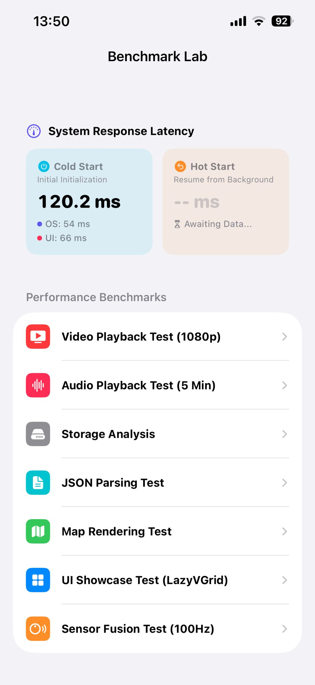

# Comparison of Mobile App Development Frameworks



A comprehensive comparative analysis project designed to evaluate the performance and hardware resource utilization of Native and Cross-Platform mobile application development approaches under the same test scenarios and workloads.

The project compares **Native Android (Kotlin), Native iOS (Swift), Kotlin Multiplatform (KMP), Flutter, and React Native** using real-world mobile application scenarios. The evaluation focuses on CPU utilization, RAM consumption, FPS, and execution-time metrics.

---

## Features

### Multi-Framework Implementation

The same benchmark scenarios are implemented using five different mobile development approaches:

* Native Android — Kotlin
* Native iOS — Swift / SwiftUI
* Kotlin Multiplatform — Compose Multiplatform
* Flutter
* React Native

### Real-World Test Scenarios

The benchmark includes commonly used mobile application workloads:

* Video playback
* Audio playback
* Map and navigation operations
* File read and write operations
* JSON data parsing
* List rendering and scrolling
* Hardware sensor access

### Comprehensive Performance Evaluation

The implementations are evaluated using the following metrics:

* CPU utilization
* Raw RAM consumption
* Net RAM consumption
* Frames per second (FPS)
* Execution time for file I/O operations
* Execution time for JSON deserialization

### Research-Oriented Structure

The repository includes raw telemetry logs and detailed statistical summaries in Excel format to support reproducibility, academic analysis, and further evaluation.

---

## Concept

In mobile software development, accurate requirements analysis and the selection of an appropriate architectural approach are important factors affecting project duration, development cost, performance, and maintainability.

The mobile application ecosystem is primarily shaped by the Android and iOS platforms. Depending on project requirements, developers may choose native development or cross-platform technologies. These approaches differ in areas such as runtime performance, development processes, resource utilization, maintenance requirements, and user experience.

This project presents a comparative evaluation of Native and Cross-Platform mobile application development approaches under the same test scenarios and workloads. The study examines CPU utilization, memory consumption, rendering performance, and execution times to provide an objective basis for evaluating the characteristics of different development approaches.

The project is intended to provide a practical reference for developers and researchers investigating mobile application architecture and framework selection.

---

## Technologies

### Mobile Development

* **Native Android:** Kotlin
* **Native iOS:** Swift, SwiftUI
* **Cross-Platform:** Kotlin Multiplatform (KMP), Flutter, React Native

### Data Analysis

* Python
* Pandas
* Matplotlib
* Microsoft Excel

---

## Project Structure

The repository is organized into four main directories containing the required assets, benchmark data, source code, and screenshots.

```text
NativeAndCrossPlatformPerformanceLab
│
├── Assets
│   └── Required images and JSON test data
│
├── Data and Results
│   └── Detailed and summarized Excel benchmark results
│
├── Projects
│   ├── FlutterPerfLab
│   ├── KotlinMultiPlatformPerfLab
│   ├── NativeKotlinPerfLab
│   ├── ReactNativePerfLab
│   └── SwiftPerfLab
│
└── Screenshots
    └── Application interface examples
```

---

# Configuration and Asset Setup

Before running the benchmark scenarios, the required media assets must be configured and a Google Maps API key must be provided for the map scenarios.

## 1. Media Assets Setup

Navigate to the `Assets` directory and extract the provided archive.

The archive contains the required:

* `.jpg` image files
* `.json` data files

### Video and Audio Files

Due to repository file-size limitations, the video and audio files are not included in the repository.

Provide:

* A suitable 1080p video file
* A suitable audio file

Rename the files as follows:

```text
test_video_1080p.mp4
test_audio_high.mp3
```

Copy the extracted image/JSON files together with the video and audio files into the corresponding asset/resource directories.

### Native Kotlin

```text
NativeKotlinPerfLab/app/src/main/assets
```

### Swift

```text
SwiftPerfLab/Resources
```

### Kotlin Multiplatform

```text
KotlinMultiPlatformPerfLab/composeApp/src/androidMain/assets
KotlinMultiPlatformPerfLab/composeApp/src/iosMain/resources
```

### Flutter

```text
FlutterPerfLab/assets
```

### React Native

```text
ReactNativePerfLab/src/assets
```

---

## 2. Google Maps API Key Setup

A Google Maps API key is required to run the map rendering benchmarks on Android.

Obtain an API key through the **Google Maps Platform** and configure it in the Android-based projects.

In the root directory of each Android-based project, check whether a `local.properties` file exists. If it does not exist, create one.

Add the following property:

```properties
MAPS_API_KEY=YOUR_API_KEY_HERE
```

The property should be configured in:

* Native Kotlin
* Kotlin Multiplatform
* Flutter (`android`)
* React Native (`android`)


---

# Usage

## Running in Release Mode

To obtain representative performance measurements, all benchmark applications should be built and executed in **Release Mode on physical devices**.

The benchmark should not be run on an emulator or in Debug Mode when reproducing the reported measurements.

---

## 1. Flutter

Navigate to the Flutter project directory and run:

```bash
flutter run --release
```

---

## 2. React Native

Navigate to the React Native project directory.

### Android

```bash
npx react-native run-android --mode release
```

### iOS

```bash
npx react-native run-ios --mode Release
```

---

## 3. Native Kotlin and Kotlin Multiplatform

Using Android Studio:

1. Open the `NativeKotlinPerfLab` or `KotlinMultiPlatformPerfLab` project.
2. Open the **Build Variants** tool window.
3. Change the active build variant from `debug` to `release`.
4. Connect a physical Android device.
5. Run the application.

For Kotlin Multiplatform, select the appropriate `composeApp` module when configuring the build variant.

---

## 4. Native Swift

Using Xcode:

1. Open `SwiftPerfLab.xcodeproj` or the corresponding workspace.
2. Go to **Product → Scheme → Edit Scheme**.
3. Select **Run** from the left sidebar.
4. Change the **Build Configuration** to `Release`.
5. Connect a physical iPhone.
6. Press **Cmd + R** to build and run the application.

---

# Benchmark Scope

The project evaluates the following scenarios across all five development approaches:

| Scenario   | Native Android | Native iOS | KMP | Flutter | React Native |
| ---------- | :------------: | :--------: | :-: | :-----: | :----------: |
| Video      |        ✓       |      ✓     |  ✓  |    ✓    |       ✓      |
| Audio      |        ✓       |      ✓     |  ✓  |    ✓    |       ✓      |
| JSON       |        ✓       |      ✓     |  ✓  |    ✓    |       ✓      |
| File Write |        ✓       |      ✓     |  ✓  |    ✓    |       ✓      |
| File Read  |        ✓       |      ✓     |  ✓  |    ✓    |       ✓      |
| Map        |        ✓       |      ✓     |  ✓  |    ✓    |       ✓      |
| List       |        ✓       |      ✓     |  ✓  |    ✓    |       ✓      |
| Sensor     |        ✓       |      ✓     |  ✓  |    ✓    |       ✓      |

---

# Data and Results

The `Data and Results` directory contains:

* Raw benchmark telemetry
* Detailed statistical results
* Summarized performance results
* CPU measurements
* Raw and net RAM measurements
* FPS measurements
* Execution-time measurements for applicable scenarios

The results are provided in Excel format to facilitate further statistical analysis and visualization.

---

# License

This project is licensed under the **MIT License**.
